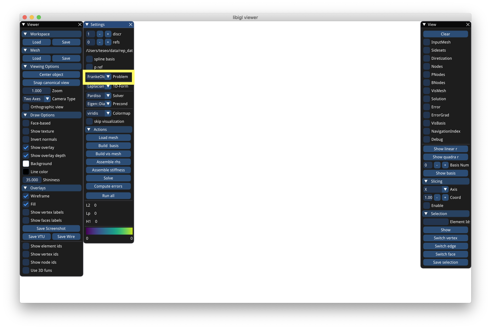
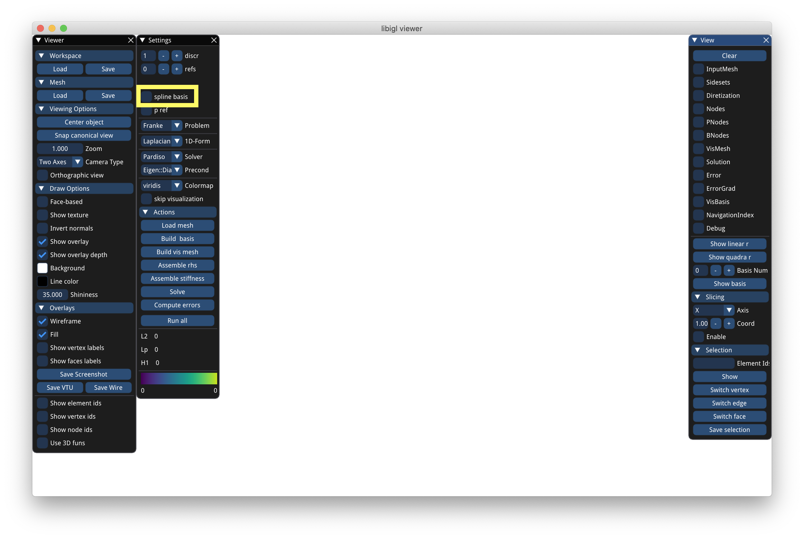

# Poly-Spline Finite-Element Method

This repository contains the scripts to regenerate the figures in the paper:
> Decoupling Simulation Accuracy from Mesh Quality

```bibtex
@article{Schneider:2019:PFM,
 author = {Schneider, Teseo and Dumas, J{\'e}r{\'e}mie and Gao, Xifeng and Botsch, Mario and Panozzo, Daniele and Zorin, Denis},
 title = {Poly-Spline Finite-Element Method},
 journal = {ACM Transactions on Graphics},
 month = {3},
 number = {3},
 pages = {19:1--19:16},
 publisher = {Association for Computing Machinery (ACM)},
 volume = {38},
 year = {2019},
}
```

# CPP installation

First clone the polyfem repository:

```bash
git clone https://github.com/polyfem/polyfem.git
```

and follow the instructions to compile it.

**Note** the examples in the paper use Padiso which requires a licence. It is free for academia or can be obtained trough MKL. This is however not necessary to reproduce the data.


## UI

You can then run the UI with
```bash
./PolyFEM_bin
```

:exclamation: The default function in polyfem is the Franke function. For this work we used an **old variation** of it. To reproduce the data select *FrankeOld* from the problem dropdown.



load the mesh and click the "run all" button.

To enable splines check the "spline" checkbox. Similarly you can use quadratic bases by increasing "discr" from 1 to 2.


## Command line

You can run the same experiment trough the command line.
You need to create a JSON file with the configuration
```json
{
    "mesh": <path to the mesh>,
    "discr_order": 1/2,
    "problem": "FrankeOld",
    "quadrature_order": 4,
    "scalar_formulation": "Laplacian",
    "solver_type": "Eigen::UmfPackLU",
    "use_spline": true/false,
    "n_refs": 1,
    "export": {
        "vis_mesh": "solution.vtu"
    }
}
```
**Note** if you have Pardiso installed, remove `"solver_type": "Eigen::UmfPackLU",` from the JSON file to fallback to the default Pardiso solver.

then run Polyfem with
```bash
./PolyFEM_bin --json <path to the json> --cmd
```
You can then see the *solution.vtu* using Paraview.

# Python

We created a simple [jupyter notebook](https://github.com/polyfem/Poly-Spline-Finite-Element-Method/blob/master/Poly-Spline-Finite-Element-Method.ipynb) with an example to generate Fig 13.
:exclamation: The problem *FrankeOld* is not yet available on the conda version of Polyfem. This however doesn't change how to use Polyfem, stay tuned for updates.


## Binder

This notebook can be interactively run with binder! It is a free service and it is slow.

[](https://mybinder.org/v2/gh/polyfem/Poly-Spline-Finite-Element-Method/master?filepath=Poly-Spline-Finite-Element-Method.ipynb)


## Local run

Install conda form [https://anaconda.org](https://anaconda.org) or a minimal version [miniconda](https://docs.conda.io/en/latest/miniconda.html).
It is a python package manager.

### Simple install

Create a conda environment directly from the environment file
```bash
conda env create -f environment.yml
```
then activate the new environment
```bash
conda activate polyspline
```
and launch the notebook
```bash
jupyter notebook
```
to run the examples.
[Here](https://jupyter-notebook.readthedocs.io/en/stable/examples/Notebook/Running%20Code.html) you can find a intro to jupyter notebooks.

### Advanced install

Create an environnement
```bash
conda create -n polyspline
```
activate it
```bash
conda activate polyspline
```
and add [conda forge](https://conda-forge.org) to the package manager channels
```bash
conda config --add channels conda-forge
```

At this point you can install all packages
```bash
conda install numpy
conda install meshplot
conda install polyfempy
conda install plotly
conda install jupyter
```
and launch the notebook
```bash
jupyter notebook
```

# Dependencies

## PolyFEM

All figures where generated with [PolyFEM](https://github.com/polyfem/polyfem). Refer to the [turorial](https://polyfem.github.io/tutorial/) and the [JSON api](https://polyfem.github.io/documentation/) for details.

Make sure that [PARDISO](https://www.pardiso-project.org/) is found and enabled, otherwise you might not be able to generate certain figures (see below). In PolyFEM, `FindPardiso.cmake` will look for the PARDISO library in `~/.local` or `~/.pardiso`. If you installed PARDISO in a different location, you may need to update this file accordingly.

## Solver

As stated in the paper, we use [PARDISO](https://www.pardiso-project.org/) for the all figures.

If you use the python version (or don't have PARDISO), polyfem will fallback to the algebraic multigrid solver [HYPRE](https://computing.llnl.gov/projects/hypre-scalable-linear-solvers-multigrid-methods).

If you try to generate the any figure with an iterative solver, running times may be exceedingly long, so it is not recommended.


# Data

The 2D mesh dataset can be found [here](https://drive.google.com/drive/folders/11KpI297PzSnArLTbZH_3UWjAytf020Ct?usp=sharing), the 3D hybrid meshes can be found [here](https://drive.google.com/drive/folders/14DmCBjiEQ-LeupLA1VOdbV87UP1lXsLA?usp=sharing), and the 3D pure hex [here](https://drive.google.com/drive/folders/1xLWq2fmsE8tc1lHkjTrftaHVMu0qEido?usp=sharing).

Smaller meshes used for the convergence plot can be downloaded [here](https://drive.google.com/drive/folders/1s23XhO5nKbTGMFm6D__lak5DMXSdAOpd?usp=sharing).